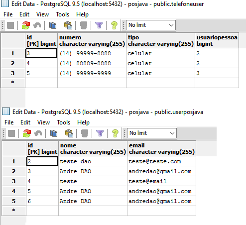

# Projeto-com-JDBC
> Aplicação que efetua cadastro de usuários e telefones com relacão entre eles.

[![Build Status][travis-image]][travis-url]
[![Downloads Stats][npm-downloads]][npm-url]

O projeto e dividido em camadas repositório, dao e conexão JDBC além de scrips sql para facilitar a criação de tabelas no postgres, para execução do teste é utlizado o Junit onde é feito as operações básicas :insert, delete, update e listagem dos dados 


Dados sendo gravados no banco de dados e exibidos no postgres

## Instalação

Windows:

```sh
Instalar a IDE eclipe disponível em https://www.eclipse.org/downloads/
Clonar o projeto git clone https://github.com/andreluis7/Projeto-com-JDBC.git
Importar projeto no eclipse e executar
```

## Exemplo de uso

A aplicação pode ser utilizada para iniciantes na área de programação ou para aqueles que estão iniciando em orientação objetos com JDBC utilizando banco de dados postgres

_Para mais exemplos, consulte [https://docs.oracle.com/en/java/_ 

## Configuração para Desenvolvimento

A aplicação não possui a necessidade de download de dependência para o seu completo funcionamento pois utiliza o maven que baixa as dependências necessárias, apenas fazer o download do banco de dados postgres e criar o banco de dados pos_java os scripts para criacao de tabelas estão no próprio projeto na pasta sql.

## Histórico de últimos commits

* (#14)
    * Exclusao de dados em cascata
* (#13)
    * Listagem do telefone por usuario
* (#12)
    * Consulta inner join telefone usuario
* (#11)
    * Salvando o telefone
* (#10)
    * Criacao da tabela telefones

## Meta

André Luís – [@andreluis7](https://www.linkedin.com/in/andr%C3%A9-lu%C3%ADs-415480116/) – adrluis7@gmail.com

Distribuído sob a licença MIT. Veja `LICENSE` para mais informações.

[https://github.com/andreluis7](https://github.com/andreluis7)

## Contributing

1. Faça o _fork_ do projeto (<https://github.com/andreluis7/Curso-Logica-De-Programacao-Com-Java/fork>)
2. Crie uma _branch_ para sua modificação (`git checkout -b feature/fooBar`)
3. Faça o _commit_ (`git commit -am 'Add some fooBar'`)
4. _Push_ (`git push origin feature/fooBar`)
5. Crie um novo _Pull Request_

[npm-image]: https://img.shields.io/npm/v/datadog-metrics.svg?style=flat-square
[npm-url]: https://npmjs.org/package/datadog-metrics
[npm-downloads]: https://img.shields.io/npm/dm/datadog-metrics.svg?style=flat-square
[travis-image]: https://img.shields.io/travis/dbader/node-datadog-metrics/master.svg?style=flat-square
[travis-url]: https://travis-ci.org/dbader/node-datadog-metrics
[wiki]: https://github.com/seunome/seuprojeto/wiki
[wiki]: https://github.com/seunome/seuprojeto/wiki
